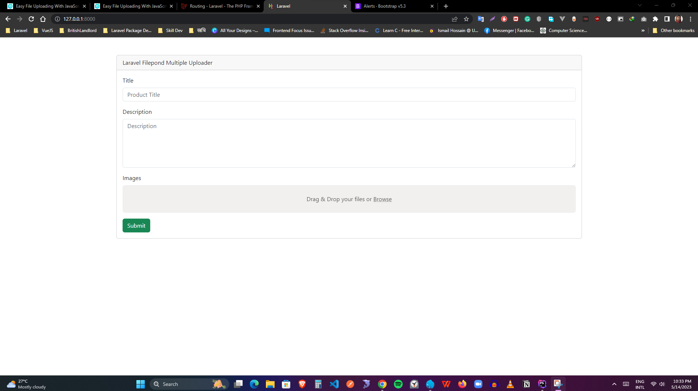
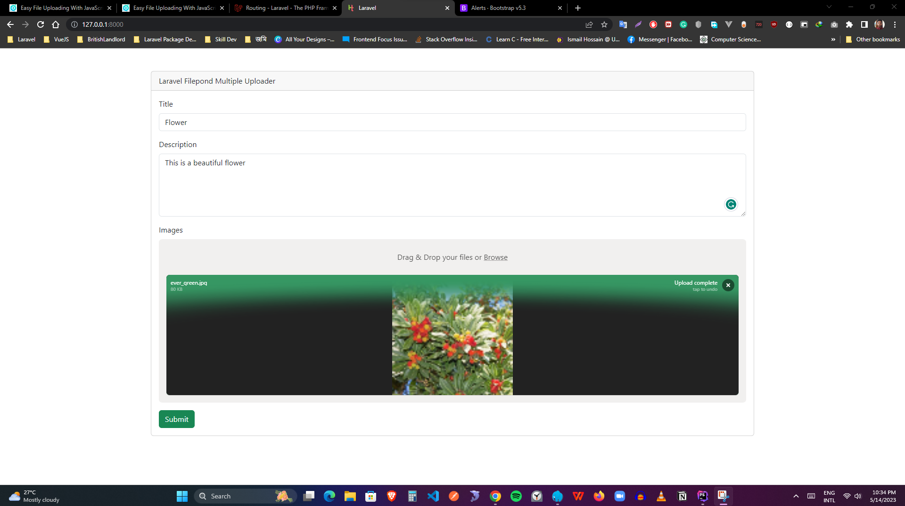
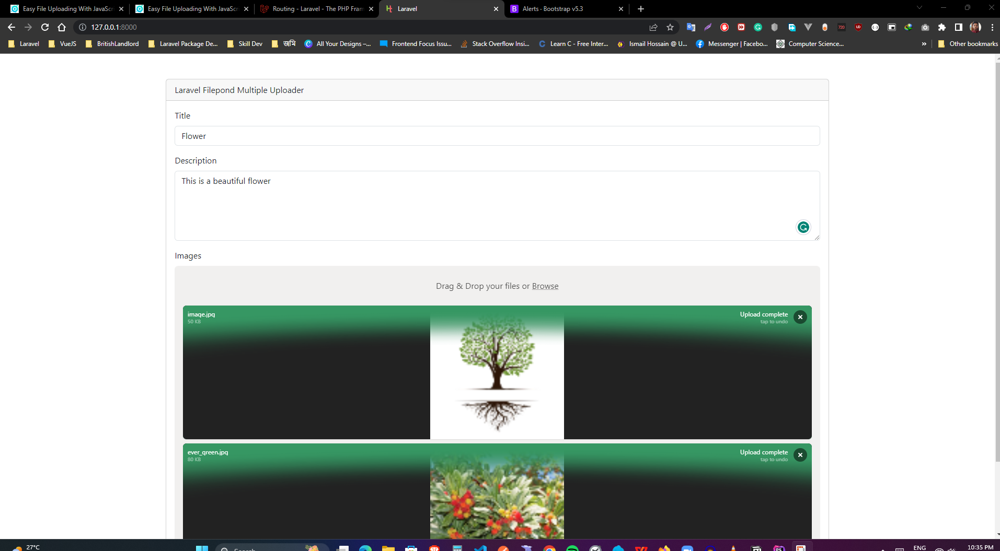
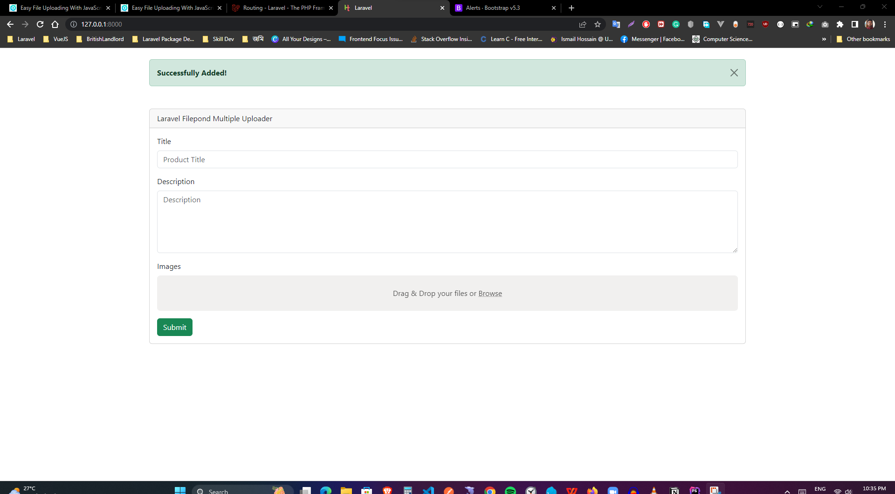

# Laravel 10 + Bootstrap 5 + Filepond

How to run this 
1) Copy .env.example and rename it to .env on same directory
2) Update .env file, Give your database informations and smtp informations for email notification
3) Run these commands on project directory require (PHP v8.1)
```
composer install
```
```
php artisan key:generate
```
```
php artisan migrate:fresh --seed
```
```
php artisan serve
```
To Access  http://127.0.0.1:8000/







